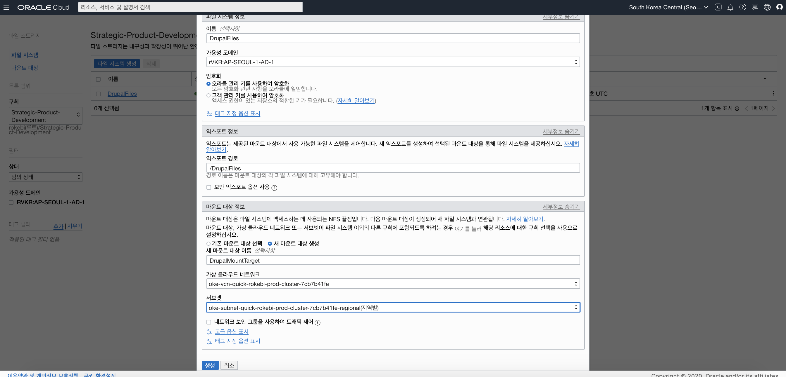
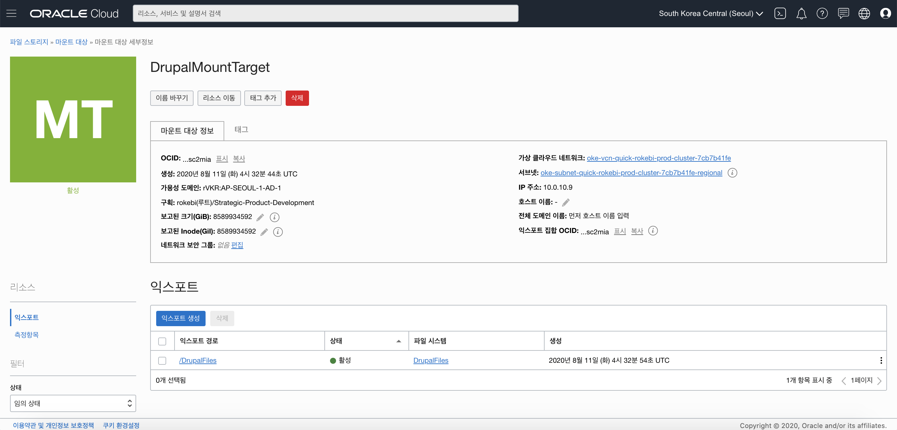
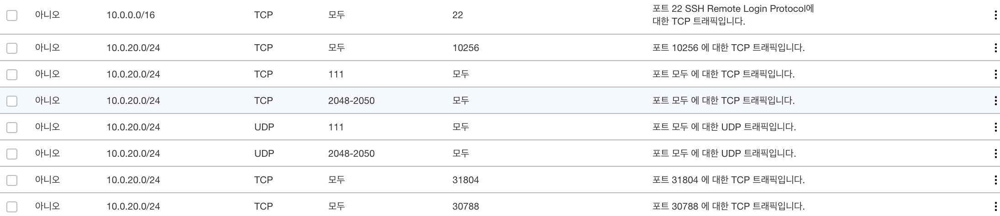

# Oracle File Storage Service with Oracle Kubernetes Engine (OKE)

#### FSS 시스템 생성 
생성을 위해 다음 5가지 정보가 필요.
>> * FSS Name
>> * Export Path
>> * Mount Target
>> * VCN (Virtual Cloud Network)
>> * Subnet

* FSS 생성 화면



#### MountTarget 정보 확인
생성된 MountTarget 상세 페이지에서 OCID와 IP, Path를 메모


#### Security List 추가
MountTarget에서 사용하는 Subnet에 Security Rule을 추가  
여기서 소스 CIDR의 경우 동일한 서브넷의 애플리케이션에서만 접근하도록 지정함



#### OKE StorageClass 생성 

* drupal-fss-sc.yaml
    > mntTargetId는 생성한 Mount Target의 OCID 값으로 대체
    ```yaml
    kind: StorageClass
    apiVersion: storage.k8s.io/v1
    metadata:
    name: drupal-fss-sc
    provisioner: oracle.com/oci-fss
    parameters:
    # Insert mount target from the FSS here
    mntTargetId: ocid1.mounttarget.oc1.ap_seoul_1.aaaaaa4np2spflc7nfrw4llqojxwiotboawxgzlpovwc2mjnmfsc2mia
    ```

#### Persistent Volume 생성

* drupal-fss-pv.yaml
    > Mount Target의 IP, Export Path를 설정
    ```yaml
    apiVersion: v1
    kind: PersistentVolume
    metadata:
    name: drupal-fss-pv
    spec:
    storageClassName: drupal-fss-sc
    capacity:
    storage: 100Gi
    accessModes:
    - ReadWriteMany
    mountOptions:
    - nosuid
    nfs:
    # Replace this with the IP of your FSS file system in OCI
    server: 10.0.10.9
    # Replace this with the Path of your FSS file system in OCI
    path: "/DrupalFiles"
    readOnly: false
    ```

#### Persistent Volume Claim 생성
* pvc의 경우 별도의 네임스페이스에 생성
    ```
    kubectl create ns drupal-fss
    ```
* drupal-fss-pvc.yaml
    > 생성한 네임스페이스와 StorageClass, Volume을 지정.
    ```
    apiVersion: v1
    kind: PersistentVolumeClaim
    metadata:
    name: drupal-fss-pvc
    namespace: drupal-fss
    spec:
    storageClassName: drupal-fss-sc
    accessModes:
    - ReadWriteMany
    resources:
    requests:
    # Although storage is provided here it is not used for FSS file systems
        storage: 100Gi
    volumeName: drupal-fss-pv
    ```

#### Nginx WebServer 및 Load Balancer 서비스 생성
  
* drupal-fss-ws.yaml
    > Nginx WebServer를 FSS에 마운트하여 3개의 Pod를 생성한 후 LoadBalancer를 생성
    ```
    apiVersion: v1
    kind: Service
    metadata:
    name: drupal-fss-pvc-svc
    namespace: drupal-fss
    labels:
        app: drupal-fss-ws 
    annotations:
        service.beta.kubernetes.io/oci-load-balancer-backend-protocol: "HTTP"
    spec:
    type: LoadBalancer
    ports:
    - port: 80
        protocol: TCP 
        targetPort: 80
    selector:
        app: drupal-fss-ws
    ---
    apiVersion: apps/v1
    kind: Deployment
    metadata:
    labels:
        app: drupal-fss-ws 
    name: drupal-fss-ws
    namespace: drupal-fss
    spec:
    selector:
        matchLabels:
        app: drupal-fss-ws
    replicas: 3
    template:
        metadata:
        labels:
            app: drupal-fss-ws 
        spec:
        containers:
        - name: drupal-fss-ws 
            image: nginx
            ports:
            - containerPort: 80
            volumeMounts:
            - name: nfs-mount
            mountPath: "/usr/share/nginx/html/"
        volumes:
        - name: nfs-mount
            persistentVolumeClaim:
            claimName: drupal-fss-pvc
            readOnly: false
  ```

#### Pod에 마운트된 FSS에 index.html 생성
* Pod 확인
```
$ kubectl get po -n drupal-fss
```

* Pod 접속
```
$ kubectl exec -it pod명 -n drupal-fss /bin/bash
```

* index.html 파일 생성
```
$ cd /usr/share/nginx/html/

$ echo "Hello World! >> index.html"
```

#### 접속 테스트
